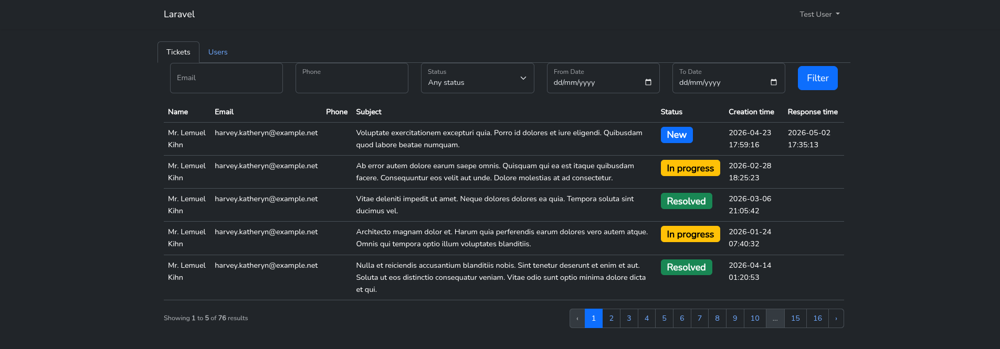
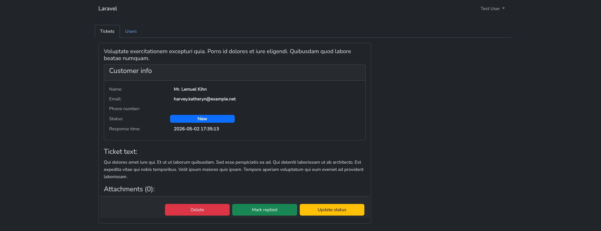
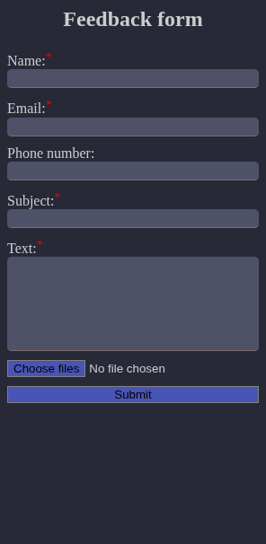

### Deploy in docker devenv manual

Setup script automatically installs all dependencies and migrates database

Docker development environment located [here](https://github.com/artem-slastyon/SmartHeadDocker)

### Screenshots







### Test data

Seeders adds to database customers, tickets and users to test

Test admin user has these credentials:

Email: `test@example.com`

Password: `password`

### Widget integration
You can integrate widget by copying this HTML code
```html
<iframe src="https://smarthead.tenorium.local/widget" width="300" height="700"></iframe>
```

### API

This app has API endpoint to create ticket (used by widget), and to get statistic.

Inside file openapi.yaml you can find API specification in format OpenAPI v3.

Also, in docker devenv added Swagger UI instance accessable at http://smarthead.tenorium.local:8080
